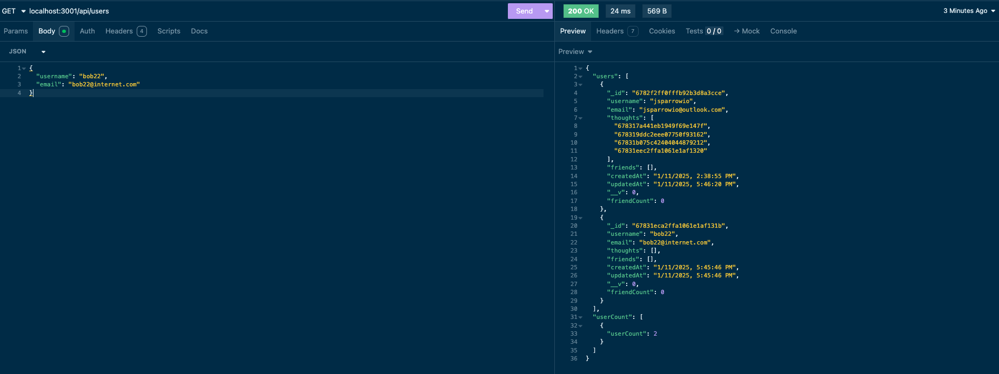

# Social Network API

                 
## Description

The social network API is a basic express.js and MongoDB based API server that handles requests to view, add, update, or delete several key social network data points such as: Users, friends, thoughts, and reactions. This API server has no front end, so much be tested using a REST API request creator such as Insomnia

## Screenshot
  

## Table of Contents
  
- [Social Network API](#social-network-api)
  - [Description](#description)
  - [Screenshot](#screenshot)
  - [Table of Contents](#table-of-contents)
  - [Installation](#installation)
  - [Usage](#usage)
  - [License](#license)
  - [Contributing](#contributing)
  - [Credits](#credits)
  - [Tests](#tests)
  - [Questions](#questions)
  
## Installation
  
Prerequisite: You must have node.js and npm (npm is typically included with node) installed in your local git-compatible command line interface prior to installing this program. If you do not have node & npm installed, please follow the installation instructions [here](https://nodejs.org/). You must also have mongoDB installed and setup. To download and install postgres, please see instructions [here](https://coding-boot-camp.github.io/full-stack/mongodb/how-to-install-mongodb). Last, you must also have Insomnia installed to test the API. See the download page [here](https://insomnia.rest/download)

Download the source code for the project with a <code>git clone</code> on this repository in your CLI using the URL or SSH link provided in the "code" button at the top of this repository. Then, <code>cd</code> in your terminal to the directory that contains the cloned repo, and run an <code>npm i</code> to ensure that you have all required dependencies to run the package successfully.
  
## Usage
  
To use, make sure you are CDed to the directory the source files live in, then run an <code>npm run start</code> to build and start your program. This will start the API server, to which you can start testing the API end points!

The API end points include:

<code>/api/users</code>

GET all users

POST a new user (for example, this JSON data would be valid):

{\
  "username": "jsparrowio",\
  "email": "jsparrowio@outlook.com"\
}

<code>/api/users/:userPId</code>

GET a single user by its _id and populated thought and friend data

PUT to update a user by its _id

DELETE to remove user by its _id

<code>/api/users/:userPId/friends/:friendPId</code>

POST to add a new friend to a user's friend list

DELETE to remove a friend from a user's friend list

<code>/api/thoughts</code>

GET to get all thoughts

POST to create a new thought (again, the following is example valid JSON data):\
{\
  "thoughtText": "This is a a thought!",\
  "username": "jsparrowio",\
  "userId": "6782f2ff0fffb92b3d8a3cce"\
}

<code>/api/thoughts/:thoughtPId</code>

GET to get a single thought by its _id

PUT to update a thought by its _id

DELETE to remove a thought by its _id

<code>/api/thoughts/:thoughtPId/reactions</code>

POST to create a reaction stored in a single thought's reactions array field

DELETE to pull and remove a reaction by the reaction's reactionId value:\
To delete, use JSON data such as:

{\
  "reactionId": "67831eca2ffa1061e1af131b"\
}

If further instruction is needed, please view walkthrough video: [here]()

## License

This project uses MIT License.

Please refer to LICENSE file for more information.

## Contributing
  
No need to contribute, however feel free to fork and make it your own!
  
## Credits
  
Majory of code written by jsparrowio (Josh Garrett) with assistance by intructors, activities, and the XPert Learning Chatbot from the edX/UofM Coding Bootcamp
  
## Tests
  
To test, follow usage instructions above.
  
## Questions
  
If you have any additional questions, please contact me at:
  
[GitHub](https://www.github.com/jsparrowio)
  
[jsparrowio@outlook.com](mailto:jsparrowio@outlook.com)